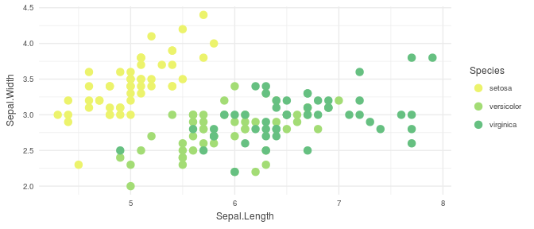
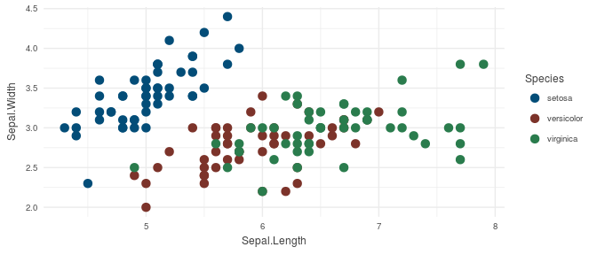

<!-- README.md is generated from README.Rmd. Please edit that file -->
SRI Package (Themes and Color Palettes)
=======================================

How to Install
--------------

``` r
devtools::install_github("kmwest/SRI")
```

Usage
-----

``` r
library(SRI)

# See palette options
names(sri_palettes)
#> [1] "sricool"    "srisunset"  "srioranges" "sriblues"   "sricolors" 
#> [6] "sricolors2" "dcfscolors"
```

Available functions
-------------------

-   theme\_sri
-   sri\_palette

Palettes
--------

### sricool

``` r
sri_palette("sricool")
```


### srisunset

``` r
sri_palette("srisunset")
```


### srioranges

``` r
sri_palette("srioranges")
```


### sriblues

``` r
sri_palette("sriblues")
```


### sricolors

``` r
sri_palette("sricolors")
```


### sricolors2

``` r
sri_palette("sricolors2")
```


### dcfscolors

``` r
sri_palette("dcfscolors")
```


Example
-------

``` r
library("ggplot2")
ggplot(iris, aes(Sepal.Length, Sepal.Width, color = Species)) +
  geom_point(size = 3) + theme_sri() + scale_color_manual(values=sri_palette("sricool"))
```



Quick format
------------

Add +sribasic to your ggplot to apply a quick set format. This applies theme\_sri and sets scale color and fill to "sricolors". For example:

``` r
ggplot(iris, aes(Sepal.Length, Sepal.Width, color = Species)) +
  geom_point(size = 3) + sribasic
```


